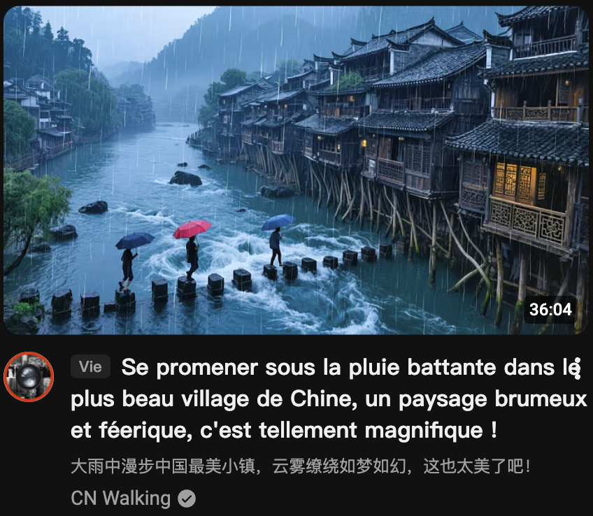
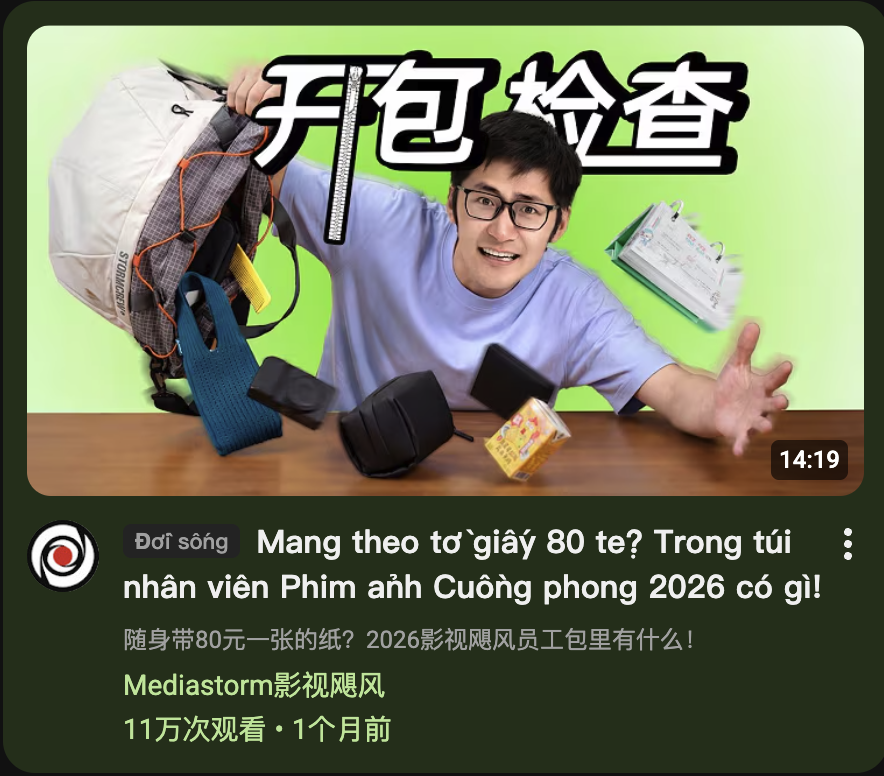
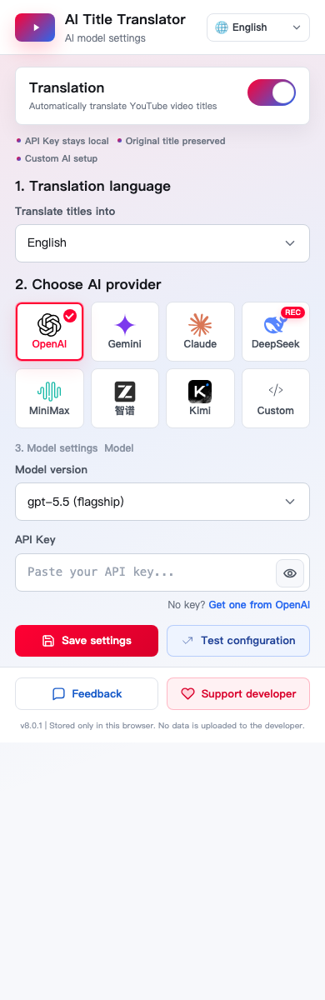

# AI Title Translator - Judul YouTube bilingual dengan AI

[](https://github.com/garygaryandfree/YouTube-AI-Title-Translator/stargazers)
[](https://github.com/garygaryandfree/YouTube-AI-Title-Translator/network)
[](https://github.com/garygaryandfree/YouTube-AI-Title-Translator/issues)
[](https://opensource.org/licenses/MIT)
[](https://chromewebstore.google.com/detail/bhajnflcikmidmdalnjhknillnkaojhk)

<p align="center">
  <a href="README.md">简体中文</a> |
  <a href="README.en.md">English</a> |
  <a href="README.ja.md">日本語</a> |
  <a href="README.ko.md">한국어</a> |
  <a href="README.th.md">ไทย</a> |
  <a href="README.es.md">Español</a> |
  <a href="README.fr.md">Français</a> |
  <a href="README.de.md">Deutsch</a> |
  <a href="README.pt.md">Português</a> |
  <a href="README.id.md">Bahasa Indonesia</a> |
  <a href="README.vi.md">Tiếng Việt</a> |
  <a href="README.ru.md">Русский</a> |
  <a href="README.ar.md">العربية</a> |
  <a href="README.hi.md">हिन्दी</a>
</p>

AI Title Translator adalah ekstensi Chrome yang menerjemahkan judul video YouTube dengan AI. Judul terjemahan ditampilkan di posisi judul, sementara judul asli tetap berada di bawahnya untuk perbandingan, membaca, dan belajar bahasa.

Sejak v8.0.1, ekstensi ini bukan lagi hanya alat untuk menerjemahkan ke bahasa Tionghoa. Ekstensi ini menangani bahasa judul YouTube umum secara otomatis dan menerjemahkan ke Inggris, Jepang, Korea, Thai, Spanyol, Prancis, Jerman, Portugis, Indonesia, Vietnam, dan varian Tionghoa.

## Key Features

| Feature | What it does |
|---------|--------------|
| Multilingual title handling | Automatically handles common title languages such as English, Chinese, Japanese, Korean, Thai, Spanish, French, German, Portuguese, Indonesian, Vietnamese, Russian, Arabic, and Hindi |
| Multiple target languages | Translate titles into Simplified Chinese, Traditional Chinese, English, Japanese, Korean, Thai, Spanish, French, German, Portuguese, Indonesian, or Vietnamese |
| AI context translation | Goes beyond word-by-word translation by understanding hooks, slang, abbreviations, creator style, and local context |
| Translation + original comparison | Shows the translated title first and keeps the original title underneath, useful for both browsing and language learning |
| Topic tags | Adds short tags such as Tech, News, Music, and Finance so you can scan video categories quickly |
| Multilingual settings UI | The extension popup defaults to English and supports 14 interface languages |
| Multiple AI providers | Supports OpenAI, Gemini, Claude, DeepSeek, MiniMax, Z.AI, Kimi, and custom OpenAI-compatible endpoints |
| Local privacy | API keys, target language, interface language, and provider settings stay in your browser |

## Compared With Machine Translation / Page Translation

| Area | Machine translation / page translation | AI Title Translator |
|------|----------------------------------------|---------------------|
| YouTube title context | Often literal and weak with hooks, memes, and shortened phrases | Uses AI to rewrite titles naturally for the selected target language |
| Source languages | Usually follows page-level language behavior | Handles multilingual YouTube titles without a source-language selector |
| Target language control | Often tied to browser or page translation settings | Lets you choose the title target language separately |
| Reading experience | May rewrite the whole page and make layout noisy | Only translates YouTube titles, with translation above and original below |
| Content scanning | You still need to read the full title | Adds topic tags for fast scanning across news, tech, finance, music, and more |
| Learning value | Original text is often replaced | Original titles stay visible for comparison and learning |
| Privacy and configuration | Usually depends on a third-party page translation service | Stores settings locally and sends title text only to the AI provider you choose |

## Demo

| English -> Japanese | English -> Korean |
|---|---|
|  |  |

| English -> Thai | English -> Spanish |
|---|---|
|  |  |

| Chinese -> English | Chinese -> French |
|---|---|
|  |  |

| Chinese -> German | Chinese -> Portuguese |
|---|---|
|  |  |

| Chinese -> Indonesian | Chinese -> Vietnamese |
|---|---|
|  |  |

## Extension Settings UI



The settings page stays compact and focused:

| Area | Purpose |
|------|---------|
| Top-right Interface language | Provides multilingual support for the extension settings page, without changing the YouTube page language or translation target |
| Translation switch | Turns automatic YouTube title translation on or off |
| Translate titles into | Chooses the target language for translated titles. The default is English |
| Choose AI provider | Selects the AI provider. DeepSeek is marked as the recommended option |
| Model settings | Chooses a preset model or lets you enter another supported model ID |
| API Key | Stores the API key for the selected provider in local Chrome storage |
| Custom endpoint | Supports OpenRouter, SiliconFlow, local Ollama, LM Studio, and other OpenAI-compatible services |
| Save settings | Saves the configuration. Refresh YouTube after changing provider, model, or API key settings |

## Supported Languages

### Translation Target Languages

```text
Simplified Chinese / Traditional Chinese / English / Japanese / Korean / Thai /
Spanish / French / German / Portuguese / Indonesian / Vietnamese
```

### Extension Interface Languages

```text
English / Simplified Chinese / Japanese / Korean / Thai / Spanish / French /
German / Portuguese / Indonesian / Vietnamese / Russian / Arabic / Hindi
```

### Automatic Source Coverage

There is no source-language selector. The extension automatically handles common YouTube title languages, including English, Chinese, Japanese, Korean, Thai, Spanish, French, German, Portuguese, Indonesian, Vietnamese, Russian, Arabic, and Hindi.

## Quick Start

### Install from Chrome Web Store

[Open the Chrome Web Store listing](https://chromewebstore.google.com/detail/bhajnflcikmidmdalnjhknillnkaojhk)

### Install in Developer Mode

1. Open [GitHub Releases](https://github.com/garygaryandfree/YouTube-AI-Title-Translator/releases).
2. Download the latest `YouTube_AI_Title_Translator_v8.0.1.zip` and unzip it locally.
3. Open `chrome://extensions/` in Chrome.
4. Enable Developer Mode.
5. Click `Load unpacked` and select the project folder.

After installing, click the extension icon in Chrome to open the settings page. Choose the settings interface language in the top-right corner, then choose the title target language under `Translate titles into`; the first-time default is English. Keep `Translation` turned on, select an AI provider and model, paste that provider's API key, and save. Refresh YouTube after changing provider, model, or API key settings.

## API Key Links

| Provider | Link |
|----------|------|
| OpenAI | [platform.openai.com/api-keys](https://platform.openai.com/api-keys) |
| Google Gemini | [aistudio.google.com/app/apikey](https://aistudio.google.com/app/apikey) |
| Claude | [console.anthropic.com/settings/keys](https://console.anthropic.com/settings/keys) |
| DeepSeek | [platform.deepseek.com/api_keys](https://platform.deepseek.com/api_keys) |
| MiniMax | [platform.minimax.io/user-center/basic-information/interface-key](https://platform.minimax.io/user-center/basic-information/interface-key) |
| Z.AI | [z.ai/manage-apikey/apikey-list](https://z.ai/manage-apikey/apikey-list) |
| Kimi | [platform.kimi.ai/console/api-keys](https://platform.kimi.ai/console/api-keys) |

## Built-in Model Presets

| Provider | Models |
|----------|--------|
| OpenAI | `gpt-5.5`, `gpt-5.4-mini`, `gpt-5.4` |
| Gemini | `gemini-3.5-flash`, `gemini-3-pro-preview`, `gemini-3-flash-preview`, `gemini-2.5-flash` |
| Claude | `claude-opus-4-7`, `claude-opus-4-6`, `claude-sonnet-4-6`, `claude-haiku-4-5` |
| DeepSeek | `deepseek-v4-flash`, `deepseek-v4-pro`, `deepseek-chat` |
| MiniMax | `MiniMax-M2.7-highspeed`, `MiniMax-M2.7`, `MiniMax-M2.5` |
| Z.AI | `glm-5.1`, `glm-5.1-flash`, `glm-4.6` |
| Kimi | `kimi-k2.6`, `kimi-k2.6-turbo`, `kimi-k2.6-thinking` |

## Custom Endpoints

Choose `Custom` if you use OpenRouter, SiliconFlow, Volcengine Ark, local Ollama, LM Studio, or another OpenAI Chat Completions compatible service.

Required fields:

- `API Endpoint`: full request URL, for example `https://openrouter.ai/api/v1/chat/completions`
- `Model name`: provider-specific model ID, for example `openai/gpt-5.4-mini`
- `API Key`: the key for that provider

When saving a new custom endpoint domain for the first time, Chrome may ask for host permission. Custom endpoints must use HTTPS, except local `localhost` debugging endpoints.

## Privacy

```text
API key / target language / interface language / provider settings -> Chrome local storage
                                                                 -> direct request to your selected AI provider
                                                                 -> never uploaded to the developer's server
```

The extension does not upload API keys, language settings, browsing history, or title content to the developer. Title text is sent only to the AI provider configured by the user for translation.

## Tech Stack

- Frontend: HTML5, CSS3, JavaScript
- Browser API: Chrome Extensions Manifest V3
- AI integrations: OpenAI API, Google Gemini API, Anthropic Claude API, DeepSeek API, MiniMax API, Z.AI GLM API, Kimi API, custom OpenAI-compatible endpoints
- Storage: Chrome Storage Local API
- Architecture: Content Script + Background Service Worker
- Build: native static extension, no build step

## Development

```bash
git clone https://github.com/garygaryandfree/YouTube-AI-Title-Translator.git
cd YouTube-AI-Title-Translator
```

Load the folder from `chrome://extensions/` with `Load unpacked`. After editing code, reload the extension and refresh YouTube.

## FAQ

### Is the extension paid?

No. The extension is free and open source. AI providers may charge for API usage.

### Are API keys uploaded to a server?

No. Settings are stored only in Chrome local storage, and requests go directly from your browser to your selected AI provider.

### Why are some titles skipped?

If a title is already in the target language, the extension skips it. For example, English titles are skipped when the target language is English, and Chinese titles are skipped when the target language is Chinese.

### Why does switching target languages trigger new translations?

The cache is target-aware. For example, the same English title translated into Chinese and Japanese is stored as two separate cache entries.

### Why does changing Interface language not refresh YouTube titles?

`Interface language` controls only the extension settings UI. YouTube title translation is controlled by `Translate titles into`, and only target-language changes need to re-render page titles.

## Feedback

- Bugs: [GitHub Issues](https://github.com/garygaryandfree/YouTube-AI-Title-Translator/issues)
- Feature requests: [GitHub Issues](https://github.com/garygaryandfree/YouTube-AI-Title-Translator/issues)
- Email: garyzhang345@gmail.com

## License

MIT License. See [LICENSE](LICENSE).

*Last updated: May 26, 2026*
