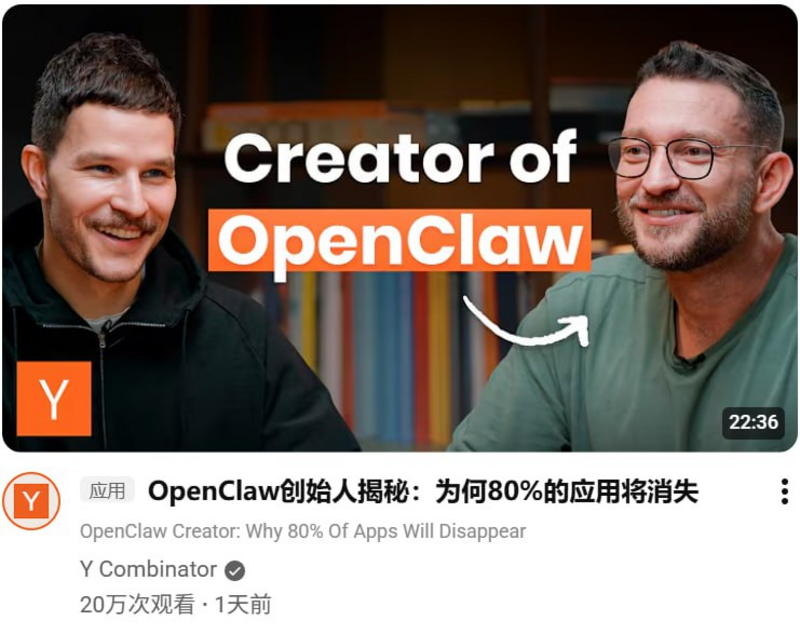
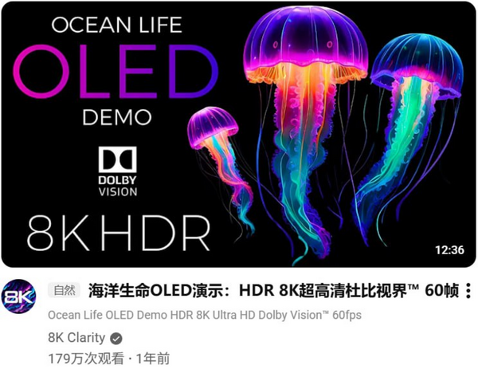

# YouTube AI Title Translator

[](https://github.com/garygaryandfree/YouTube-AI-Title-Translator/stargazers)
[](https://github.com/garygaryandfree/YouTube-AI-Title-Translator/network)
[](https://github.com/garygaryandfree/YouTube-AI-Title-Translator/issues)
[](https://opensource.org/licenses/MIT)

一个用于自动翻译 YouTube 视频标题的 Chrome 扩展。它支持 DeepSeek、OpenAI、Google Gemini、MiniMax 以及自定义 OpenAI 兼容端点，API Key 仅保存在当前浏览器本地，不经过任何中转服务器。

## 当前版本：v7.1 清爽配置中心

v7.1 是一次面向日常使用体验的大版本迭代。核心目标不是堆功能，而是让配置过程更清楚、更稳定、更容易被普通用户理解。

本次更新重新设计了整个弹窗配置页：顶部品牌区、翻译开关、AI 服务商选择、模型配置、API Key 输入、高级设置和保存操作都重新排版。界面去掉了旧版偏重的红色光晕和装饰阴影，改为更轻、更干净的视觉语言；主操作色也从高饱和大红调整为清新的青绿色，让开关和保存按钮更耐看。

AI 服务商区域现在使用本地品牌图标资源，DeepSeek、OpenAI、Gemini、MiniMax 和自定义端点有更明确的识别度。API Key 输入增加了显示/隐藏按钮，服务商卡片增加键盘可访问操作，保存后的状态反馈也改成更自然的中文提示。

## v7.1 更新内容

| 模块 | 更新 |
|------|------|
| 配置页面 | 全新弹窗布局，信息层级更清晰，操作路径更短 |
| 视觉设计 | 移除光晕和厚重阴影，采用简洁、轻量、留白更合理的界面 |
| 主题色 | 将主操作色调整为清新的青绿色，降低视觉压力 |
| 服务商选择 | 新增/优化本地品牌图标资源，支持 DeepSeek、OpenAI、Gemini、MiniMax、自定义 |
| 翻译开关 | 修正开关按钮居中问题，视觉状态更稳定 |
| API Key | 增加显示/隐藏能力，减少配置时的输入确认成本 |
| 可访问性 | 服务商卡片支持键盘 Enter/Space 选择，并同步 aria 状态 |
| 隐私提示 | 强化“仅本地存储，不上传数据”的说明 |

## 功能亮点

| 特性 | 说明 |
|------|------|
| 多模型支持 | DeepSeek、OpenAI、Google Gemini、MiniMax、自定义 OpenAI 兼容接口 |
| 本地隐私 | API Key 与配置只保存在 Chrome 本地存储 |
| 自动翻译 | 打开 YouTube 后自动识别并翻译视频标题 |
| 成本优化 | 本地缓存翻译结果，减少重复 API 调用 |
| 自定义端点 | 可接入兼容 OpenAI 格式的第三方服务 |
| 原生体验 | 翻译结果直接融入 YouTube 标题区域 |

## 安装方式

### Chrome Web Store

[前往 Chrome 应用商店安装](https://chromewebstore.google.com/detail/youtube-ai-%E6%A0%87%E9%A2%98%E7%BF%BB%E8%AF%91-%E5%85%A8%E8%83%BD%E7%89%88/bhajnflcikmidmdalnjhknillnkaojhk)

### 开发者模式安装

1. 下载本仓库代码，或在 GitHub 点击 `Code` -> `Download ZIP`。
2. 解压到本地文件夹。
3. 在 Chrome 地址栏打开 `chrome://extensions/`。
4. 打开右上角“开发者模式”。
5. 点击“加载已解压的扩展程序”，选择项目文件夹。

## 使用方法

1. 点击浏览器右上角的扩展图标。
2. 打开“翻译开关”。
3. 选择 AI 服务商。
4. 选择模型版本。
5. 填入对应服务商的 API Key。
6. 点击“保存设置”。
7. 刷新 YouTube 页面后开始自动翻译标题。

## API Key 获取入口

| 服务商 | 获取地址 |
|--------|----------|
| DeepSeek | [platform.deepseek.com/api_keys](https://platform.deepseek.com/api_keys) |
| OpenAI | [platform.openai.com/api-keys](https://platform.openai.com/api-keys) |
| Google Gemini | [makersuite.google.com/app/apikey](https://makersuite.google.com/app/apikey) |
| MiniMax | [platform.minimaxi.com/user-center/basic-information/interface-key](https://platform.minimaxi.com/user-center/basic-information/interface-key) |

## 自定义端点

如果你使用的是 OpenRouter、SiliconFlow、火山方舟、本地 Ollama、LM Studio，或其他兼容 OpenAI Chat Completions 格式的服务，可以选择“自定义”服务商。

需要填写：

- `API Endpoint`：完整的接口地址，例如 `https://openrouter.ai/api/v1/chat/completions`
- `模型名称`：服务商要求的模型 ID，例如 `openai/gpt-4o-mini`
- `API Key`：对应服务商的密钥

首次保存新的接口域名时，Chrome 可能会弹出权限确认，这是为了让扩展能直接访问你填写的服务商地址。

## 效果演示

### 插件配置界面


### YouTube 翻译效果



### 更多翻译示例



## 技术说明

| 项目 | 说明 |
|------|------|
| 扩展规范 | Chrome Extensions Manifest V3 |
| 页面技术 | HTML、CSS、JavaScript |
| 存储方式 | Chrome Storage Local API |
| AI 接入 | DeepSeek API、OpenAI API、Gemini API、MiniMax API、自定义 OpenAI 兼容端点 |
| 构建方式 | 原生开发，无构建依赖 |

## 项目结构

```text
YouTube-AI-Title-Translator/
├── assets/brands/        # AI 服务商品牌图标
├── background.js         # 扩展后台脚本
├── content.js            # YouTube 页面内容脚本
├── icon.png              # 扩展图标
├── manifest.json         # Chrome 扩展配置
├── popup.html            # 弹窗配置页面
├── popup.js              # 弹窗交互逻辑
├── screenshots/          # 项目截图
├── styles.css            # YouTube 页面注入样式
└── README.md             # 项目说明
```

## 本地开发

```bash
git clone https://github.com/garygaryandfree/YouTube-AI-Title-Translator.git
cd YouTube-AI-Title-Translator
```

修改代码后，在 `chrome://extensions/` 页面点击该扩展的刷新按钮，然后重新打开扩展弹窗或刷新 YouTube 页面。

## 常见问题

### 插件本身收费吗？

插件本身免费开源。AI 服务商可能会根据 API 使用量收费，具体以对应平台规则为准。

### API Key 会上传到服务器吗？

不会。配置只写入当前浏览器的本地存储，扩展会直接从本地向你选择的 AI 服务商发起请求。

### 为什么需要刷新 YouTube 页面？

保存新配置后，已经打开的 YouTube 页面需要重新加载内容脚本，刷新页面后新配置会生效。

### 支持自定义模型吗？

支持。选择“自定义”后，可以填写兼容 OpenAI 接口格式的 API Endpoint 和模型名。

## 反馈与支持

- Bug 反馈：[GitHub Issues](https://github.com/garygaryandfree/YouTube-AI-Title-Translator/issues)
- 功能建议：[提交建议](https://github.com/garygaryandfree/YouTube-AI-Title-Translator/issues)
- 邮件联系：garyzhang345@gmail.com
- 支持开发者：[爱发电](https://afdian.com/a/garygary)

## 开源协议

本项目基于 MIT License 开源，详情见 [LICENSE](LICENSE)。

## 致谢

感谢 DeepSeek、OpenAI、Google Gemini、MiniMax 提供模型与 API 能力，也感谢所有测试用户的反馈。

*最后更新：2026年5月4日*
