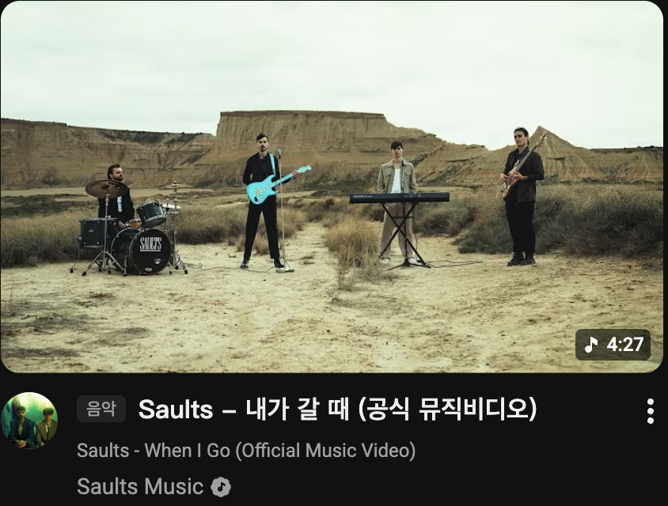
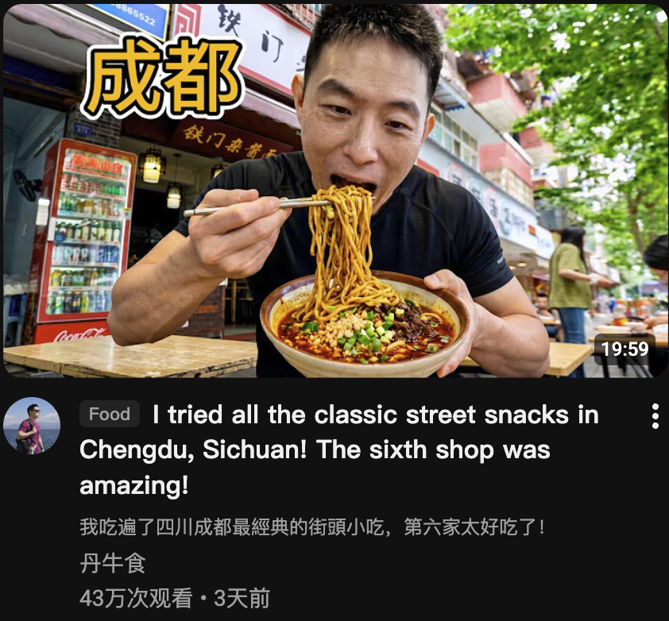
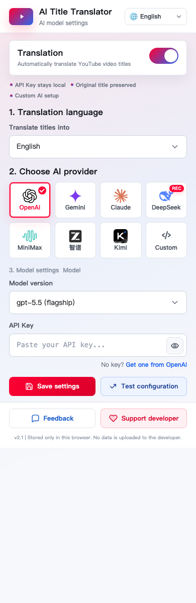

# YouTube 标题翻译 - AI 双语标题

[](https://github.com/garygaryandfree/YouTube-AI-Title-Translator/stargazers)
[](https://github.com/garygaryandfree/YouTube-AI-Title-Translator/network)
[](https://github.com/garygaryandfree/YouTube-AI-Title-Translator/issues)
[](https://opensource.org/licenses/MIT)
[](https://chromewebstore.google.com/detail/bhajnflcikmidmdalnjhknillnkaojhk)

<p align="center">
  <a href="README.md">简体中文</a> |
  <a href="README.en.md">English</a> |
  <a href="README.ja.md">日本語</a> |
  <a href="README.ko.md">한국어</a> |
  <a href="README.th.md">ไทย</a> |
  <a href="README.es.md">Español</a> |
  <a href="README.fr.md">Français</a> |
  <a href="README.de.md">Deutsch</a> |
  <a href="README.pt.md">Português</a> |
  <a href="README.id.md">Bahasa Indonesia</a> |
  <a href="README.vi.md">Tiếng Việt</a> |
  <a href="README.ru.md">Русский</a> |
  <a href="README.ar.md">العربية</a> |
  <a href="README.hi.md">हिन्दी</a>
</p>

AI Title Translator 是一个 Chrome 扩展，用 AI 自动翻译 YouTube 视频标题，并把译文直接显示在标题位置，原文保留在下方。你可以边浏览边对照原文，既方便快速理解内容，也方便学习其他语言的真实表达。

v2.1 起，插件不再只面向“翻译成中文”。它可以自动处理常见 YouTube 标题语言，也可以把标题翻译成英文、日语、韩语、泰语、西班牙语、法语、德语、葡萄牙语、印尼语、越南语等目标语言。无论你想看全球新闻、科技趋势、财经信息、生活方式、音乐内容，还是世界各国 YouTuber 的频道，它都能帮你更快判断视频讲什么。

## v2.1 最新更新

- 全新 popup 配置界面：视觉更清爽，保留轻量工具感。
- 新增 `Test configuration`：保存前可测试当前服务商、模型和 API Key 是否可用。
- 优化主操作按钮：保存和测试按钮更紧凑，同时保持比反馈入口更高的操作优先级。
- 明确本地预览提示：直接打开 `popup.html` 时只用于界面预览，真实测试需要在已安装的 Chrome 扩展弹窗中进行。
- 修复测试配置成功判断：现在正确读取 background 返回的 `result.translatedTitle`。

## 重要特征

| 能力 | 说明 |
|------|------|
| 多语言标题识别 | 自动处理英文、中文、日语、韩语、泰语、西班牙语、法语、德语、葡萄牙语、印尼语、越南语、俄语、阿拉伯语、印地语等多种语言 |
| 多目标语言翻译 | 支持把标题翻译成简体中文、繁体中文、英文、日语、韩语、泰语、西班牙语、法语、德语、葡萄牙语、印尼语、越南语 |
| AI 语境翻译 | 不是逐词替换，而是理解 YouTube 标题里的梗、语气、缩写、标题党表达和本土语境 |
| 译文 + 原文对照 | 译文作为主标题显示，原文保留在下方，适合快速浏览和语言学习 |
| 内容标签 | 自动生成 Tech、News、Music、Finance 等内容标签，先判断类型再决定要不要点开 |
| 多语言配置界面 | 插件配置界面默认英文，并支持中文、日语、韩语、泰语、西语、法语、德语等 14 种界面语言 |
| 多 AI 服务商 | 支持 OpenAI、Gemini、Claude、DeepSeek、MiniMax、Z.AI、Kimi 和自定义 OpenAI 兼容端点 |
| 本地隐私 | API Key、界面语言、目标语言、服务商配置只保存在当前浏览器本地 |

## 和传统机翻 / 普通网页翻译的对比

| 对比项 | 传统机翻 / 普通网页翻译 | AI Title Translator |
|--------|--------------------------|---------------------|
| YouTube 标题理解 | 常按字面翻译，容易忽略标题党、梗和省略表达 | 用 AI 理解标题语境，输出更像本土用户会写的标题 |
| 多语言输入 | 取决于网页翻译能力，常按整页语言处理 | 自动处理多国语言标题，不需要手动选择源语言 |
| 翻译目标 | 通常跟随浏览器或网页翻译设置 | 可单独选择标题翻译目标语言，支持多种目标语言 |
| 阅读体验 | 常改动整页，页面信息可能混乱 | 只处理 YouTube 标题，译文在上、原文在下，方便对照 |
| 内容判断 | 只能读完标题再判断视频类型 | 标题前带内容标签，快速识别科技、新闻、财经、音乐等主题 |
| 学习价值 | 原文常被覆盖，不方便对照学习 | 原文保留在译文下方，适合学习真实标题表达 |
| 隐私与配置 | 通常依赖第三方网页翻译服务 | API Key 和配置本地保存，请求直接发给你选择的 AI 服务商 |

## 效果演示

| 英文 -> 日语 | 英文 -> 韩语 |
|---|---|
|  |  |

| 英文 -> 泰语 | 英文 -> 西班牙语 |
|---|---|
|  |  |

| 中文 -> 英文 | 中文 -> 法语 |
|---|---|
|  |  |

| 中文 -> 德语 | 中文 -> 葡萄牙语 |
|---|---|
|  |  |

| 中文 -> 印尼语 | 中文 -> 越南语 |
|---|---|
|  |  |

## 插件配置界面



配置页面保持简洁，主要包含这些区域：

| 区域 | 作用 |
|------|------|
| 右上角 Interface language | 插件配置页面多语种支持，不影响 YouTube 页面语言，也不影响标题翻译目标 |
| Translation 开关 | 控制是否在 YouTube 页面自动翻译视频标题 |
| Translate titles into | 选择标题要翻译成什么语言，默认英文 |
| Choose AI provider | 选择调用哪个 AI 服务商，DeepSeek 标记为推荐选项 |
| Model settings | 选择模型版本，也可以选择其他模型并手动填写模型 ID |
| API Key | 填写你自己在对应 AI 服务商申请的 API Key |
| Custom endpoint | 使用 OpenRouter、SiliconFlow、本地 Ollama、LM Studio 等兼容 OpenAI 格式的服务 |
| Save settings | 保存配置。保存服务商、模型或 API Key 后，建议刷新 YouTube 页面 |
| Test configuration | 在真实扩展弹窗中测试当前服务商、模型和 API Key 是否可用 |

## 支持的语言

### 可翻译成的目标语言

```text
简体中文 / 繁體中文 / English / 日本語 / 한국어 / ไทย /
Español / Français / Deutsch / Português / Bahasa Indonesia / Tiếng Việt
```

### 插件配置界面语言

```text
English / 简体中文 / 日本語 / 한국어 / ไทย / Español / Français / Deutsch /
Português / Bahasa Indonesia / Tiếng Việt / Русский / العربية / हिन्दी
```

### 自动处理的常见源语言

插件不提供源语言选择。它会自动处理常见 YouTube 标题语言，包括英文、中文、日语、韩语、泰语、西班牙语、法语、德语、葡萄牙语、印尼语、越南语、俄语、阿拉伯语、印地语等。

## 快速开始

### 方法一：Chrome Web Store 安装

[点击前往 Chrome 应用商店下载](https://chromewebstore.google.com/detail/bhajnflcikmidmdalnjhknillnkaojhk)

### 方法二：开发者模式安装

1. 打开 [GitHub Releases](https://github.com/garygaryandfree/YouTube-AI-Title-Translator/releases)。
2. 下载最新版本的 `YouTube_AI_Title_Translator_v2.1.zip`，并解压到本地文件夹。
3. 在 Chrome 地址栏输入 `chrome://extensions/`。
4. 开启右上角“开发者模式”。
5. 点击“加载已解压的扩展程序”，选择解压后的项目文件夹。

安装后点击浏览器右上角的插件图标进入配置页面。你可以先在右上角选择配置界面的显示语言，然后在 `Translate titles into` 里选择标题要翻译成的目标语言；首次使用默认英文。确认 `Translation` 开关已开启后，选择 AI 服务商和模型版本，粘贴对应服务商的 API Key 并保存。保存服务商、模型或 API Key 后，刷新 YouTube 页面即可开始自动翻译标题。

## API Key 获取入口

| 服务商 | 获取地址 |
|--------|----------|
| OpenAI | [platform.openai.com/api-keys](https://platform.openai.com/api-keys) |
| Google Gemini | [aistudio.google.com/app/apikey](https://aistudio.google.com/app/apikey) |
| Claude | [console.anthropic.com/settings/keys](https://console.anthropic.com/settings/keys) |
| DeepSeek | [platform.deepseek.com/api_keys](https://platform.deepseek.com/api_keys) |
| MiniMax | [platform.minimax.io/user-center/basic-information/interface-key](https://platform.minimax.io/user-center/basic-information/interface-key) |
| Z.AI | [z.ai/manage-apikey/apikey-list](https://z.ai/manage-apikey/apikey-list) |
| Kimi | [platform.kimi.ai/console/api-keys](https://platform.kimi.ai/console/api-keys) |

## 内置模型列表

| 服务商 | 模型 |
|--------|------|
| OpenAI | `gpt-5.5`、`gpt-5.4-mini`、`gpt-5.4` |
| Gemini | `gemini-3.5-flash`、`gemini-3-pro-preview`、`gemini-3-flash-preview`、`gemini-2.5-flash` |
| Claude | `claude-opus-4-7`、`claude-opus-4-6`、`claude-sonnet-4-6`、`claude-haiku-4-5` |
| DeepSeek | `deepseek-v4-flash`、`deepseek-v4-pro`、`deepseek-chat` |
| MiniMax | `MiniMax-M2.7-highspeed`、`MiniMax-M2.7`、`MiniMax-M2.5` |
| Z.AI | `glm-5.1`、`glm-5.1-flash`、`glm-4.6` |
| Kimi | `kimi-k2.6`、`kimi-k2.6-turbo`、`kimi-k2.6-thinking` |

## 自定义端点

如果你使用的是 OpenRouter、SiliconFlow、火山方舟、本地 Ollama、LM Studio，或其他兼容 OpenAI Chat Completions 格式的服务，可以选择 `Custom`。

需要填写：

- `API Endpoint`：完整接口地址，例如 `https://openrouter.ai/api/v1/chat/completions`
- `Model name`：服务商要求的模型 ID，例如 `openai/gpt-5.4-mini`
- `API Key`：对应服务商的密钥

首次保存新的接口域名时，Chrome 可能会弹出权限确认，这是为了让扩展能直接访问你填写的服务商地址。自定义端点必须使用 HTTPS；本机 `localhost` 调试接口除外。

## 隐私与数据

```text
API Key / 目标语言 / 界面语言 / 服务商配置 -> Chrome 本地存储
                                      -> 直接请求用户选择的 AI 服务商
                                      -> 不上传到作者服务器
```

扩展不会把 API Key、目标语言、界面语言、浏览记录或标题内容上传到作者服务器。标题文本只会发送给你自己配置的 AI 服务商，用于完成翻译。

## 技术栈

- 前端：HTML5、CSS3、JavaScript
- 浏览器 API：Chrome Extensions Manifest V3
- AI 集成：OpenAI API、Google Gemini API、Anthropic Claude API、DeepSeek API、MiniMax API、Z.AI GLM API、Kimi API、自定义 OpenAI 兼容端点
- 存储：Chrome Storage Local API
- 架构：Content Script + Background Service Worker
- 构建：原生静态扩展，无构建依赖

## 开发者指南

```bash
git clone https://github.com/garygaryandfree/YouTube-AI-Title-Translator.git
cd YouTube-AI-Title-Translator
```

在 `chrome://extensions/` 页面通过“加载已解压的扩展程序”安装。修改代码后，点击该扩展的刷新按钮，然后重新打开扩展弹窗或刷新 YouTube 页面。

## 常见问题

### 插件本身收费吗？

插件本身免费开源。AI 服务商可能会根据 API 使用量收费，具体以对应平台规则为准。

### API Key 会上传到服务器吗？

不会。配置只写入当前浏览器本地存储，扩展会直接从本地向你选择的 AI 服务商发起请求。

### 为什么有些标题不会翻译？

如果标题已经是目标语言，插件会跳过它。例如目标语言是英文时，英文标题不会重复翻译；目标语言是中文时，中文标题不会重复翻译。

### 为什么切换目标语言后需要重新翻译？

缓存按目标语言区分。比如同一个英文标题翻译成中文和日语会保存为两条不同缓存，避免切换语言后显示错误译文。

### 为什么切换 Interface language 不会刷新 YouTube 页面？

`Interface language` 只控制插件配置界面语言。YouTube 页面上的翻译目标由 `Translate titles into` 控制，只有切换目标语言时才需要重绘页面标题。

## 反馈与支持

- Bug 反馈：[GitHub Issues](https://github.com/garygaryandfree/YouTube-AI-Title-Translator/issues)
- 功能建议：[GitHub Issues](https://github.com/garygaryandfree/YouTube-AI-Title-Translator/issues)
- 邮件联系：garyzhang345@gmail.com

## 开源协议

本项目采用 MIT License 开源，详情见 [LICENSE](LICENSE)。

*最后更新：2026年5月26日*
