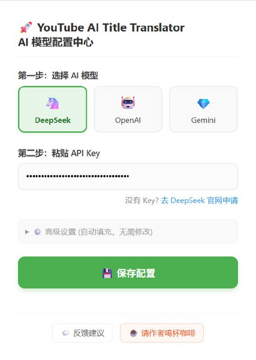

# YouTube 标题翻译 - AI双语标题

[](https://github.com/garygaryandfree/YouTube-AI-Title-Translator/stargazers)
[](https://github.com/garygaryandfree/YouTube-AI-Title-Translator/network)
[](https://github.com/garygaryandfree/YouTube-AI-Title-Translator/issues)
[](https://opensource.org/licenses/MIT)
[](https://chrome.google.com/webstore)

英文名：AI Title Translator - AI Bilingual

一个专门为中文用户设计的 YouTube 视频标题 AI 翻译插件。它不只是把英文标题机械翻成中文，而是用大模型理解标题语境、视频类型和表达习惯，把标题翻成更自然、更有中文味儿的表达。

## 当前版本：v7.2 多模型配置中心

v7.2 聚焦多模型配置体验：新增 Claude、智谱、Kimi，删除重复的高级设置，并支持为每个服务商手动填写模型 ID。

| 更新点 | 说明 |
|--------|------|
| 配置简化 | 删除“高级设置”区，减少重复入口 |
| 服务商扩展 | 新增 Claude、智谱、Kimi，整体改为 4 列两行布局 |
| 模型更新 | 更新 OpenAI、Gemini、Claude、DeepSeek、MiniMax、智谱、Kimi 的推荐模型 |
| 手动模型 | 所有预设服务商都支持“其他（手动输入模型名）” |
| Claude 支持 | Background Service Worker 增加 Anthropic Messages API 调用格式 |
| 品牌图标 | Claude、智谱/Z.ai、Kimi 使用真实 logo 资源 |
| 视觉调整 | 主操作色和“支持开发者”按钮统一为红色系 |

## 为什么用这个插件

如果你经常看国外 YouTube 视频，但不想每次都读英文标题，这个插件可以帮你解决90%的问题：标题翻译+标签识别，帮你一秒判断这个视频到底在讲什么。

普通翻译工具更擅长逐词翻译，但 YouTube 标题经常有梗、夸张表达、省略语、挑战句式和内容营销写法。这个插件的目标不是逐字翻译，而是把 YouTube 标题改写成更自然的中文标题：理解标题里的语气、上下文、专业词和视频类型，同时保留原标题的吸引力。翻译结果会直接嵌入 YouTube 页面，让你先判断视频类型，再决定要不要点开。

支持的标签包括：

```text
科技 / 游戏 / 音乐 / 教程 / 搞笑 / 新闻 / 财经 / 生活 / 体育 / 影视 / 美食 / 其它
```

## 功能亮点

| 功能 | 说明 |
|------|------|
| 多 AI 服务商 | 支持 OpenAI、Google Gemini、Claude、DeepSeek、MiniMax、智谱、Kimi 和自定义端点 |
| 多语种翻译 | 支持 英、日、韩、泰 4种语言翻译 |
| 标题智能改写 | 理解俚语、梗、专业术语和 YouTube 标题风格，输出更自然的中文标题 |
| 内容标签 | 每个标题前自动显示分类标签，快速判断视频主题 |
| 本地隐私 | API Key 仅保存在当前浏览器本地，不经过作者服务器 |
| 智能缓存 | 相同标题只翻译一次，多个标题合并请求，减少重复 token 消耗与API调用次数 |
| 原生体验 | 翻译结果直接融入 YouTube 页面，不需要额外窗口 |
| 自定义端点 | 支持 OpenRouter、SiliconFlow、火山方舟、本地 Ollama、LM Studio 等 OpenAI 兼容服务 |

## 快速开始

### 安装方法

#### 方法一：Chrome Web Store

[点击前往 Chrome 应用商店下载](https://chromewebstore.google.com/detail/bhajnflcikmidmdalnjhknillnkaojhk)

#### 方法二：开发者模式安装

1. 下载项目代码：点击右上角 `Code` -> `Download ZIP`。
2. 解压文件到本地文件夹。
3. 在 Chrome 地址栏输入 `chrome://extensions/`。
4. 开启右上角“开发者模式”。
5. 点击“加载已解压的扩展程序”，选择解压后的项目文件夹。

### 配置步骤

1. 点击浏览器右上角的插件图标。
2. 打开“翻译开关”。
3. 选择 AI 服务商：OpenAI、Gemini、Claude、DeepSeek、MiniMax、智谱、Kimi 或自定义。
4. 选择模型版本。
5. 粘贴对应服务商的 API Key。
6. 点击“保存设置”。
7. 刷新 YouTube 页面，开始自动翻译标题。

## API Key 获取入口

| 服务商 | 获取地址 |
|--------|----------|
| OpenAI | [platform.openai.com/api-keys](https://platform.openai.com/api-keys) |
| Google Gemini | [aistudio.google.com/app/apikey](https://aistudio.google.com/app/apikey) |
| Claude | [console.anthropic.com/settings/keys](https://console.anthropic.com/settings/keys) |
| DeepSeek | [platform.deepseek.com/api_keys](https://platform.deepseek.com/api_keys) |
| MiniMax | [platform.minimaxi.com/user-center/basic-information/interface-key](https://platform.minimaxi.com/user-center/basic-information/interface-key) |
| 智谱 | [bigmodel.cn/usercenter/proj-mgmt/apikeys](https://bigmodel.cn/usercenter/proj-mgmt/apikeys) |
| Kimi | [platform.kimi.com/console/api-keys](https://platform.kimi.com/console/api-keys) |

## 内置模型列表

插件会提供常用模型预设，也允许你手动填写模型 ID。

| 服务商 | 默认模型 |
|--------|----------|
| OpenAI | `gpt-5.5`、`gpt-5.4-mini`、`gpt-5.4` |
| Gemini | `gemini-3-pro-preview`、`gemini-3-flash-preview`、`gemini-2.5-flash` |
| Claude | `claude-opus-4-7`、`claude-opus-4-6`、`claude-sonnet-4-6`、`claude-haiku-4-5` |
| DeepSeek | `deepseek-v4-flash`、`deepseek-v4-pro`、`deepseek-chat` |
| MiniMax | `MiniMax-M2.7-highspeed`、`MiniMax-M2.7`、`MiniMax-M2.5` |
| 智谱 | `glm-5.1`、`glm-5.1-flash`、`glm-4.6` |
| Kimi | `kimi-k2.6`、`kimi-k2.6-turbo`、`kimi-k2.6-thinking` |

如果下拉里没有你想用的模型，选择“其他（手动输入模型名）”，然后填写服务商文档中给出的模型 ID。

## 自定义端点

如果你使用的是 OpenRouter、SiliconFlow、火山方舟、本地 Ollama、LM Studio，或其他兼容 OpenAI Chat Completions 格式的服务，可以选择“自定义”服务商。

需要填写：

- `API Endpoint`：完整的接口地址，例如 `https://openrouter.ai/api/v1/chat/completions`
- `模型名称`：服务商要求的模型 ID，例如 `openai/gpt-5.4-mini`
- `API Key`：对应服务商的密钥

首次保存新的接口域名时，Chrome 可能会弹出权限确认，这是为了让扩展能直接访问你填写的服务商地址。

## 效果演示

### 插件配置界面



### Chrome Web Store 截图


截图展示了 YouTube 页面中的标题翻译、内容标签和多模型配置体验。灰色标签表示视频内容类型，下方显示原始英文标题，方便你在不丢失原文信息的情况下快速理解内容。

## 主要功能

### 1. 智能标题翻译

- 上下文理解：不只是字面翻译，而是理解视频标题想表达什么。
- 文化适配：俚语、梗、专业术语会尽量转换成中文用户更容易理解的表达。
- 标题风格保持：尽量保留原标题的吸引力和语气。

### 2. 标题内容标签

AI 会为每个标题返回一个内容标签，例如科技、游戏、教程、财经、影视等。你不用先读完整标题，就能快速判断视频内容方向。

### 3. 隐私安全架构

```text
用户 API Key -> 本地浏览器存储 -> 直接请求 AI 服务商
                 |
                 -> 不上传到作者服务器
```

### 4. 成本优化策略

- 智能缓存：相同标题只翻译一次。
- 批量处理：多个标题合并请求，减少 API 调用次数。
- 多模型选择：按质量、速度、价格选择最合适的模型；如果列表里没有目标模型，也可以手动填写模型 ID。
- 闲置额度利用：适合消耗已经购买但用不完的 coding plan、token plan 或 API 余额。

### 5. 用户体验优化

- 实时翻译：页面加载和滚动时自动处理新标题。
- 无缝集成：翻译内容嵌入 YouTube 页面，不需要打开额外窗口。
- 一键暂停：不需要翻译时可以直接关闭主开关。
- 本地配置中心：服务商、模型、API Key、自定义端点集中管理。

## 性能对比

| 功能 | 传统机翻 / 普通网页翻译 | 本插件 |
|------|--------------------------|--------|
| 翻译质量 | 偏直译，容易有翻译腔 | 更自然，更有中文味儿 |
| 标题理解 | 很少理解梗、标题党和上下文 | 结合语境重写中文标题 |
| 内容判断 | 只能读完整标题 | 标题前直接显示内容标签 |
| 隐私保护 | 取决于翻译服务 | API Key 和配置本地保存 |
| 成本控制 | 不可控或无模型选择 | 缓存、批量、多模型可选 |
| 自定义能力 | 通常不可自定义模型 | 支持自定义 OpenAI 兼容端点 |

## 技术栈

- 前端：HTML5、CSS3、JavaScript
- 浏览器 API：Chrome Extensions Manifest V3
- AI 集成：OpenAI API、Google Gemini API、Anthropic Claude API、DeepSeek API、MiniMax API、智谱 GLM API、Kimi API、自定义 OpenAI 兼容端点
- 存储：Chrome Storage Local API
- 架构：Content Script + Background Service Worker
- 构建：原生开发，无构建依赖

## 开发者指南

### 项目结构

```text
YouTube-AI-Title-Translator/
├── assets/brands/        # AI 服务商品牌图标
├── background.js         # 后台请求与 AI 翻译服务
├── content.js            # YouTube 页面内容脚本
├── icon/                 # Chrome 扩展图标尺寸
├── manifest.json         # Chrome 扩展配置
├── popup.html            # 弹窗配置页面
├── popup.js              # 弹窗交互逻辑
├── screenshots/          # 项目截图
├── styles.css            # YouTube 页面注入样式
└── README.md             # 项目说明
```

### 本地开发

```bash
git clone https://github.com/garygaryandfree/YouTube-AI-Title-Translator.git
cd YouTube-AI-Title-Translator
```

在 `chrome://extensions/` 页面通过“加载已解压的扩展程序”安装。修改代码后，点击该扩展的刷新按钮，然后重新打开扩展弹窗或刷新 YouTube 页面。

### 贡献指南

1. Fork 本仓库。
2. 创建功能分支：`git checkout -b feature/AmazingFeature`。
3. 提交更改：`git commit -m 'Add some AmazingFeature'`。
4. 推送到分支：`git push origin feature/AmazingFeature`。
5. 开启 Pull Request。

## 常见问题

### 插件本身收费吗？

插件本身免费开源。AI 服务商可能会根据 API 使用量收费，具体以对应平台规则为准。

### API Key 会上传到服务器吗？

不会。配置只写入当前浏览器的本地存储，扩展会直接从本地向你选择的 AI 服务商发起请求。

### 翻译真的比 Google 翻译更好吗？

这个插件的目标不是逐词翻译，而是把 YouTube 标题翻成更自然的中文标题。对标题党、梗、口语、专业词和视频语境，它通常会比传统机翻更容易读懂。

### 为什么标题前面会有标签？

标签用来帮你快速判断视频类型。比如看到“财经”“教程”“影视”这类标签，你可以先判断视频内容方向，再决定是否点开。

### 为什么需要刷新 YouTube 页面？

保存新配置后，已经打开的 YouTube 页面需要重新加载内容脚本，刷新页面后新配置会生效。

### 支持自定义模型吗？

支持。每个预设服务商的模型下拉里都有“其他（手动输入模型名）”。选择后填写该服务商支持的模型 ID 即可。

如果你使用 OpenRouter、SiliconFlow、火山方舟、本地 Ollama、LM Studio 等第三方或本地模型服务，可以选择“自定义”，填写兼容 OpenAI 接口格式的 API Endpoint 和模型名。

### 支持其他语言吗？

当前主要面向英文 YouTube 标题到简体中文的翻译场景。后续可以继续扩展更多语言。

## 反馈与支持

- Bug 反馈：[GitHub Issues](https://github.com/garygaryandfree/YouTube-AI-Title-Translator/issues)
- 功能建议：[提交建议](https://github.com/garygaryandfree/YouTube-AI-Title-Translator/issues)
- 邮件联系：garyzhang345@gmail.com

## 开源协议

本项目采用 MIT License 开源，详情见 [LICENSE](LICENSE)。

## 开发者寄语

这是一个由独立开发者维护的开源项目。如果它确实帮你节省了时间，也欢迎自愿支持项目继续更新。

<table>
  <tr>
    <td align="center">
      <br>
      微信
    </td>
    <td align="center">
      <br>
      支付宝
    </td>
  </tr>
</table>

*最后更新：2026年5月5日*
