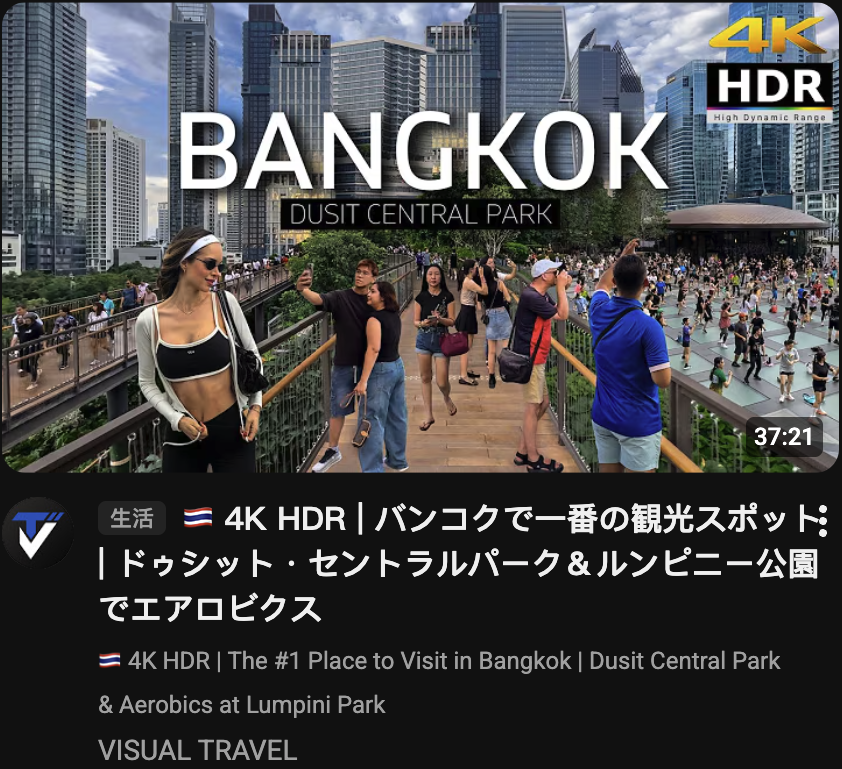
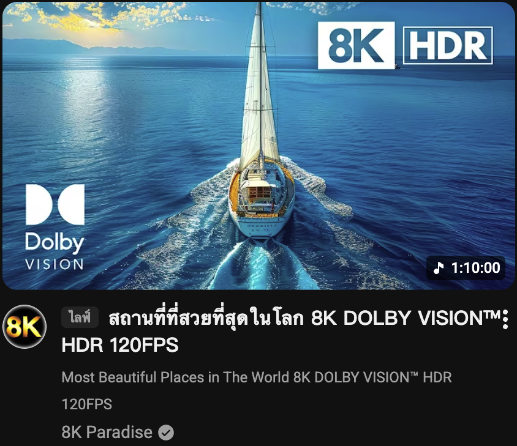
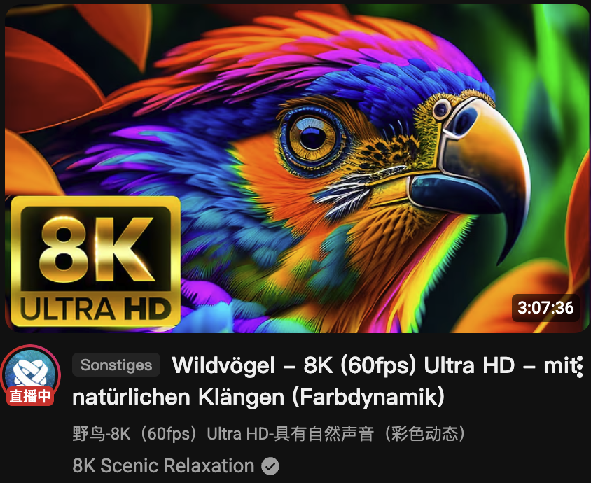
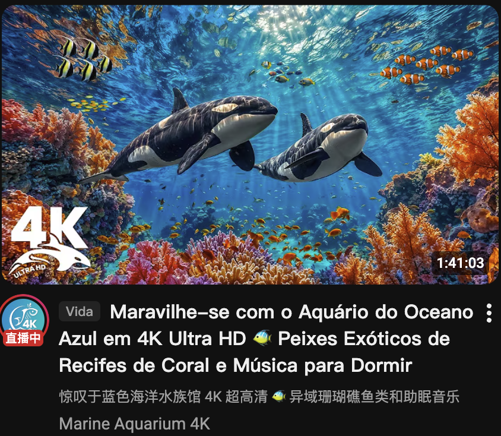
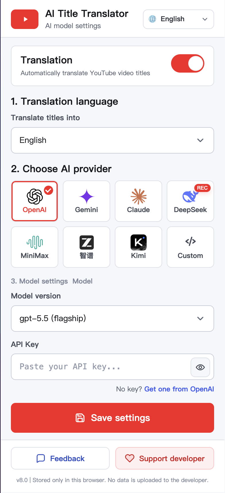

# AI Title Translator - แปลชื่อ YouTube ด้วย AI

  <a href="README.md">简体中文</a> |
  <a href="README.en.md">English</a> |
  <a href="README.ja.md">日本語</a> |
  <a href="README.ko.md">한국어</a> |
  <a href="README.th.md">ไทย</a> |
  <a href="README.es.md">Español</a> |
  <a href="README.fr.md">Français</a> |
  <a href="README.de.md">Deutsch</a> |
  <a href="README.pt.md">Português</a> |
  <a href="README.id.md">Bahasa Indonesia</a> |
  <a href="README.vi.md">Tiếng Việt</a> |
  <a href="README.ru.md">Русский</a> |
  <a href="README.ar.md">العربية</a> |
  <a href="README.hi.md">हिन्दी</a>

AI Title Translator คือส่วนขยาย Chrome สำหรับแปลชื่อวิดีโอ YouTube ด้วย AI โดยแสดงคำแปลเป็นชื่อหลักและเก็บชื่อเดิมไว้ด้านล่างเพื่อเทียบความหมายและเรียนภาษา

ตั้งแต่ V8 เป็นต้นไป คุณสามารถแปลเป็นอังกฤษ ญี่ปุ่น เกาหลี ไทย สเปน ฝรั่งเศส เยอรมัน โปรตุเกส อินโดนีเซีย เวียดนาม และจีนได้

## คุณสมบัติหลัก

| รองรับหลายภาษา | แปลชื่อจากหลายภาษาและเลือกภาษาเป้าหมายได้หลายภาษา |
|---|---|
| แปลตามบริบท | AI เข้าใจสำนวน มุก คำย่อ และบริบทของ YouTube |
| คำแปล + ต้นฉบับ | แสดงคำแปลด้านบนและต้นฉบับด้านล่าง |

## Demo

| English -> Japanese | English -> Korean |
|---|---|
|  |  |

| English -> Thai | English -> Spanish |
|---|---|
|  |  |

| Chinese -> English | Chinese -> French |
|---|---|
|  |  |

| Chinese -> German | Chinese -> Portuguese |
|---|---|
|  |  |

| Chinese -> Indonesian | Chinese -> Vietnamese |
|---|---|
|  |  |

## หน้าตั้งค่าส่วนขยาย

`Interface language` เลือกภาษาของหน้าตั้งค่าเท่านั้น. `Translate titles into` chooses the target language for YouTube titles. Turn on `Translation`, choose an AI provider and model, paste your API Key, save, then refresh YouTube.

## Supported languages

**Target languages:** Simplified Chinese / Traditional Chinese / English / Japanese / Korean / Thai / Spanish / French / German / Portuguese / Indonesian / Vietnamese

**Interface languages:** English / 简体中文 / 日本語 / 한국어 / ไทย / Español / Français / Deutsch / Português / Bahasa Indonesia / Tiếng Việt / Русский / العربية / हिन्दी

## เริ่มต้นใช้งาน

ติดตั้งจาก Chrome Web Store หรือดาวน์โหลด `YouTube_AI_Title_Translator_v8.0.zip` ล่าสุดจาก GitHub Releases แล้วโหลดผ่าน `chrome://extensions/` ใน Developer Mode.

## API providers

OpenAI, Google Gemini, Claude, DeepSeek, MiniMax, Z.AI, Kimi, and custom OpenAI-compatible endpoints are supported. Gemini presets include `gemini-3.5-flash`, `gemini-3-pro-preview`, `gemini-3-flash-preview`, and `gemini-2.5-flash`.

## Privacy

API keys, target language, interface language, and provider settings are stored only in Chrome local storage. Title text is sent only to the AI provider configured by the user.

## License

MIT License. See [LICENSE](LICENSE).
